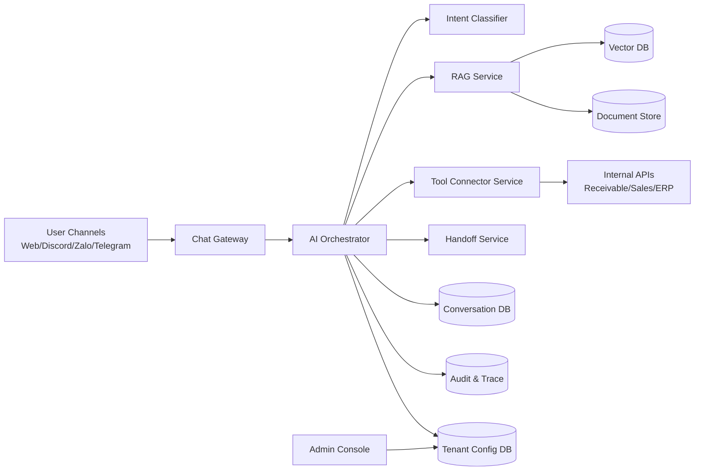

# PRD — AI Support Bot đa tenant cho công ty phần mềm (v1.0)

- **Owner:** Master Orchestrator
- **Ngày:** 2026-03-04
- **Trạng thái:** Draft triển khai
- **Mục tiêu:** Đủ chi tiết để team bắt tay build ngay (không chỉ định hướng)

---

## 1) Tóm tắt sản phẩm

### 1.1 Bài toán
Công ty phần mềm đang support khách hàng qua chat nhưng gặp:
- Ticket lặp lại cao (hướng dẫn sử dụng cơ bản)
- Trả lời không đồng nhất giữa nhân sự
- Mất thời gian tra cứu dữ liệu vận hành (công nợ, sales, trạng thái đơn…)
- Thiếu phân luồng rõ ràng giữa “hướng dẫn sử dụng” và “báo lỗi phần mềm”

### 1.2 Giải pháp
Xây **AI Support Bot đa tenant** có khả năng:
1. Trả lời câu hỏi bằng **Knowledge Base + Vector DB (RAG)** theo từng tenant
2. Tự gọi **tool/API nội bộ** (ví dụ tra cứu công nợ theo tháng, theo sales)
3. Tự phân loại hội thoại + gắn nhãn + chuyển người thật khi bot không chắc
4. Cho phép tenant tự cấu hình model, flow, skill, guardrail

### 1.3 In scope (v1)
- Chat text inbound/outbound
- RAG theo tenant
- Tool calling có kiểm soát quyền
- Handoff người thật
- Admin console cấu hình tenant
- Logging/trace/audit

### 1.4 Out of scope (v1)
- Voice realtime 2 chiều
- Tự động sửa lỗi hệ thống production
- Agent tự quyết thay đổi business rules mà không qua duyệt

---

## 2) Mục tiêu & KPI

### 2.1 Mục tiêu kinh doanh
- Giảm tải đội support
- Tăng tốc độ phản hồi
- Chuẩn hóa chất lượng trả lời
- Tạo nền tảng mở rộng đa tenant

### 2.2 KPI mục tiêu (90 ngày)
- **Deflection rate** (bot xử lý xong không cần người): >= 40%
- **First response time (p95):** < 10 giây
- **Intent classification accuracy:** >= 90%
- **Tool-call success rate:** >= 98%
- **Handoff đúng nhóm:** >= 90%
- **CSAT sau chat bot:** >= 4.2/5

---

## 3) Roles & Permissions (RBAC)

## 3.1 Danh sách role
1. **End User** (khách hàng)
2. **Support Agent** (nhân sự CS)
3. **Support Lead** (quản lý support)
4. **Tenant Admin** (quản trị tenant)
5. **System Admin** (quản trị nền tảng)
6. **AI Bot** (thực thể tự động, bị giới hạn quyền)

### 3.2 Ma trận quyền (rút gọn)

| Function | End User | Support Agent | Support Lead | Tenant Admin | System Admin | AI Bot |
|---|---|---|---|---|---|---|
| Gửi câu hỏi | ✅ | ✅ | ✅ | ✅ | ✅ | ❌ |
| Xem hội thoại tenant | Chỉ của mình | ✅ | ✅ | ✅ | ✅ | Chỉ context phiên |
| Gắn nhãn hội thoại | ❌ | ✅ | ✅ | ✅ | ✅ | ✅ (rule-based) |
| Chuyển người thật (handoff) | Yêu cầu | ✅ | ✅ | ✅ | ✅ | ✅ (khi low confidence) |
| Cấu hình prompt/flow | ❌ | ❌ | ❌ | ✅ | ✅ | ❌ |
| Cấu hình tool/API | ❌ | ❌ | ❌ | ✅ (tenant scope) | ✅ (global) | ❌ |
| Xem audit log | ❌ | ❌ | ✅ (tenant) | ✅ (tenant) | ✅ (all) | ❌ |
| Gọi endpoint công nợ | ❌ | ✅ | ✅ | ✅ | ✅ | ✅ (qua policy) |

### 3.3 Nguyên tắc quyền
- Mọi request đều bắt buộc `tenant_id`
- AI Bot chỉ gọi tool trong **allowlist của tenant**
- Tác vụ tài chính cần `role` hợp lệ + audit trail
- Không cho bot truy cập endpoint thô ngoài schema

---

## 4) Chức năng chi tiết (Functions)

### 4.1 F-001 — Intent Detection & Routing
- Phân loại: `how_to_use`, `billing_receivable`, `sales_lookup`, `bug_report`, `other`
- Output gồm: intent, confidence, recommended_flow
- Nếu confidence < ngưỡng => hỏi làm rõ hoặc handoff

### 4.2 F-002 — RAG theo tenant
- Ingest tài liệu (PDF, DOCX, markdown, URL)
- Chunk + embedding + lưu vector namespace theo tenant
- Retrieval top-k + rerank
- Trả lời kèm nguồn (citation)

### 4.3 F-003 — Tool Calling nội bộ
- Tool mẫu v1:
  - `check_receivable_by_month`
  - `check_receivable_by_sales`
  - `get_customer_contract_status`
- Bắt buộc validate input schema trước khi gọi
- Timeout/retry/circuit breaker

### 4.4 F-004 — Handoff người thật
- Trigger khi:
  - low confidence
  - user yêu cầu gặp người thật
  - tool fail nhiều lần
  - intent bug_report mức cao
- Tạo handoff ticket + gắn nhãn + chuyển queue

### 4.5 F-005 — Label & Conversation Management
- Label chuẩn: `how_to_use`, `billing`, `sales`, `bug`, `feature_request`, `urgent`
- Trạng thái: `open`, `waiting_user`, `resolved`, `escalated`

### 4.6 F-006 — Tenant Configuration
- Cấu hình riêng mỗi tenant:
  - Model/provider
  - Prompt policy
  - Tool allowlist
  - Handoff rules
  - Locale/language/tone
  - Confidence threshold

### 4.7 F-007 — Dynamic Flow Builder (v1.5-ready)
- Lưu flow dạng JSON state machine
- Node types: `classify`, `retrieve_kb`, `call_tool`, `ask_clarify`, `handoff`, `finalize`
- Versioned flow + rollback

### 4.8 F-008 — Observability & Analytics
- Lưu trace mỗi turn
- Dashboard: volume, resolution, handoff rate, failed intents, top unanswered questions

---

## 5) Use Cases chi tiết

### UC-001: Hỏi cách dùng phần mềm
1. User hỏi tính năng
2. Bot classify = `how_to_use`
3. RAG tìm tài liệu tenant
4. Trả lời + nguồn
5. User confirm solved

**Acceptance:** trả lời <10s, có citation, đúng tenant context

### UC-002: Tra cứu công nợ tháng này
1. User yêu cầu kiểm tra công nợ
2. Bot xác thực role + tenant
3. Bot gọi tool `check_receivable_by_month`
4. Chuẩn hóa output (bảng + tổng)
5. Trả lời user

**Acceptance:** dữ liệu khớp API nguồn, log đầy đủ request id

### UC-003: Tra cứu công nợ theo sales
1. User đưa sales name/id + tháng
2. Bot validate input
3. Bot gọi tool `check_receivable_by_sales`
4. Trả kết quả + cảnh báo nếu data thiếu

### UC-004: Bot không chắc
1. Confidence thấp hoặc tool lỗi >2 lần
2. Bot thông báo chuyển người thật
3. Tạo handoff event + label
4. Gán queue support phù hợp

### UC-005: Tenant cập nhật KB
1. Tenant admin upload tài liệu
2. Hệ thống ingest + embedding
3. Tài liệu vào index tenant
4. Trả trạng thái indexing

---

## 6) Non-Functional Requirements

- **Latency**: p95 chat turn < 10s
- **Availability**: 99.9% (khung giờ business)
- **Data isolation**: tenant A không bao giờ đọc tenant B
- **Security**: mã hóa at-rest + in-transit
- **Auditability**: mọi tool call có trace id, actor, tenant, timestamp
- **Scalability**: 200 tenant, 2k hội thoại đồng thời (mục tiêu 12 tháng)

---

## 7) Kiến trúc hệ thống

### 7.1 Logical Architecture



### 7.2 Service boundaries
- **Gateway**: quản lý channel adapter
- **Orchestrator**: logic điều phối state + quyết định flow
- **RAG service**: ingestion/retrieval/rerank/citation
- **Tool connector**: adapter chuẩn hóa gọi API nội bộ
- **Handoff service**: queue + assignment + SLA
- **Admin console**: quản trị tenant settings

### 7.3 Multi-tenant isolation model
- DB row-level bằng `tenant_id`
- Vector namespace theo `tenant_id`
- Provider keys tách riêng từng tenant
- Secret manager theo tenant scope

---

## 8) Tech Stack đề xuất

## 8.1 Core stack (khuyến nghị triển khai thật)
- **Backend API:** NestJS (Node.js)
- **Database:** PostgreSQL 16
- **Vector:** pgvector (v1), nâng Qdrant khi scale cao
- **Queue/Worker:** Redis + BullMQ
- **Admin UI:** Next.js + TypeScript
- **Auth/RBAC:** Keycloak hoặc Auth0 (OIDC), JWT claims có tenant/role
- **Observability:** OpenTelemetry + Prometheus + Grafana + Loki
- **Object Storage:** S3-compatible (MinIO/GCS)

### 8.2 LLM & Agent framework decision
- **v1:** Orchestrator tự viết + state machine (để kiểm soát rõ và debug dễ)
- **v1.5/v2:** cân nhắc LangGraph khi flow đa agent phức tạp

**Vì sao chưa full LangGraph ngay:**
- MVP cần tốc độ build và predictable behavior
- Nhiều use case là tool + policy orchestration, không cần agent graph nặng từ đầu

### 8.3 Open-source reuse đề xuất
- pgvector
- BullMQ
- Langfuse (prompt/trace/eval)
- Unstructured (document parsing)
- n8n (workflow ngoài nếu cần)

---

## 9) Data Model (minimum)

## 9.1 Bảng lõi
- `tenants(id, name, status, created_at)`
- `tenant_configs(tenant_id, llm_provider, model, thresholds, flow_version, ... )`
- `users(id, tenant_id, external_id, role, ... )`
- `conversations(id, tenant_id, channel, customer_id, status, labels, assigned_to, ... )`
- `messages(id, conversation_id, sender_type, content, metadata, created_at)`
- `kb_documents(id, tenant_id, source, title, status, ...)`
- `kb_chunks(id, tenant_id, document_id, chunk_text, embedding, metadata)`
- `tool_definitions(id, tenant_id, name, schema, endpoint, auth_config)`
- `tool_call_logs(id, tenant_id, conversation_id, tool_name, request, response, status, latency_ms)`
- `handoff_events(id, tenant_id, conversation_id, reason, queue, status)`
- `audit_logs(id, tenant_id, actor_type, actor_id, action, resource, payload, created_at)`

## 9.2 Indexing bắt buộc
- `conversations(tenant_id, status, updated_at)`
- `messages(conversation_id, created_at)`
- `tool_call_logs(tenant_id, created_at)`
- vector index trên `kb_chunks.embedding`

---

## 10) API Contracts (v1)

### 10.1 Chat APIs
- `POST /v1/tenants/{tenantId}/chat/message`
- `GET /v1/tenants/{tenantId}/conversations/{id}`
- `POST /v1/tenants/{tenantId}/conversations/{id}/labels`

### 10.2 Tool APIs (internal standardized)
- `POST /v1/tools/receivable/by-month`
- `POST /v1/tools/receivable/by-sales`
- `POST /v1/tools/contracts/status`

### 10.3 Handoff APIs
- `POST /v1/tenants/{tenantId}/handoff`
- `PATCH /v1/tenants/{tenantId}/handoff/{id}`

### 10.4 Admin APIs
- `PUT /v1/tenants/{tenantId}/config`
- `POST /v1/tenants/{tenantId}/kb/documents`
- `POST /v1/tenants/{tenantId}/flows/publish`

---

## 11) Dynamic mở rộng (thiết kế cụ thể)

### 11.1 Skill Manifest schema
```json
{
  "id": "check_receivable_by_month",
  "version": "1.0.0",
  "input_schema": {"type": "object", "properties": {"month": {"type": "string"}}},
  "required_roles": ["support_agent", "tenant_admin"],
  "allowed_tools": ["receivable_api"],
  "fallback": "handoff"
}
```

### 11.2 Flow config schema
- Mỗi tenant có `flow_version`
- Mỗi flow có graph node + condition
- Cho phép A/B test giữa flow versions

### 11.3 Plugin/provider abstraction
- Chuẩn interface:
  - `generate()`
  - `embed()`
  - `transcribe()` (future)
- Đổi provider không ảnh hưởng business flow

### 11.4 Rule engine
- Rule theo tenant:
  - confidence threshold
  - handoff conditions
  - restricted intents

---

## 12) Security & Compliance

- JWT + tenant claim bắt buộc
- Tool secrets để trong Secret Manager
- PII masking trong logs
- Rate-limit theo user + tenant
- Prompt injection guard:
  - không cho model tự mở endpoint ngoài allowlist
  - tool-call phải đi qua validator + policy engine

---

## 13) Rollout plan

### Phase 1 (2 tuần) — Core MVP
- Chat pipeline
- Intent + RAG
- 1 tool công nợ theo tháng
- Basic handoff

### Phase 2 (2 tuần)
- Tool theo sales
- Admin config tenant
- Label analytics

### Phase 3 (2 tuần)
- Dynamic flow versioning
- Evaluation dashboard
- Hardening + load test

---

## 14) Testing strategy

- Unit test: intent router, validators, policy engine
- Integration test: tool connector, RAG retrieval
- E2E: 5 use-cases chính
- Security test: tenant isolation, privilege escalation
- Chaos test: tool timeout, provider failover

---

## 15) Acceptance Criteria (Go-Live)

- [ ] 5 UC chính pass UAT
- [ ] Tool-call logging đầy đủ
- [ ] Handoff đúng queue >= 90%
- [ ] Deflection >= 30% trong pilot
- [ ] Không rò rỉ dữ liệu cross-tenant
- [ ] Runbook vận hành + rollback có kiểm thử

---

## 16) Risks & Mitigations

1. **RAG trả lời sai ngữ cảnh**
   - Mitigation: citation bắt buộc + confidence gate + feedback loop
2. **Tool API nội bộ không ổn định**
   - Mitigation: retry/backoff/circuit breaker + fallback human
3. **Prompt injection**
   - Mitigation: policy engine trước tool call, output sanitization
4. **Tenant config quá tự do gây hỗn loạn**
   - Mitigation: config templates + staged publish + rollback

---

## 17) Triển khai team (đề xuất)

- **Backend:** API + orchestrator + connectors
- **Database:** schema + index + migration
- **Frontend:** admin console + monitoring UI
- **DevOps:** CI/CD + secrets + observability
- **QA:** test plan + regression + UAT
- **Master/Architect:** governance + interface contracts

---

## 18) Deliverables kỹ thuật đi kèm PRD

1. `specs/prd-ai-support-bot-v1.md` (file này)
2. `specs/api/openapi.yaml` (API contracts)
3. `specs/data/erd-v1.md` (ERD chi tiết)
4. `specs/flows/tenant-flow-schema.json` (flow schema)
5. `specs/runbooks/operations.md` (vận hành + incident)

---

## 19) Quyết định kiến trúc (ADR rút gọn)

- Chọn **NestJS + Postgres + pgvector** để ra MVP nhanh, vận hành đơn giản
- Dùng **custom orchestrator** trước, chưa khóa chặt vào framework agent nặng
- Thiết kế extension points cho LangGraph ở phase sau
- Multi-tenant isolation là ưu tiên số 1 từ ngày đầu

---

## 20) Bước tiếp theo ngay

1. Chốt API `receivable/by-month` và `receivable/by-sales`
2. Chốt schema `tenant_configs` + `tool_definitions`
3. Build vertical slice: UC-002 từ chat -> tool -> response -> audit
4. Demo nội bộ với 1 tenant trong 3–5 ngày
